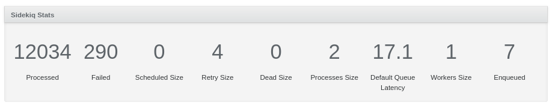

# About

This repository contains an Active Admin component to display Sidekiq statistics . It adds a very simple panel that you can for example include in your dashboard page.



# Installation

Add `gem 'active_admin-sidekiq_stats'` to your Gemfile and execute `bundle`.

In your Active Admin page add the component through the Arbre builder method `active_admin_sidekiq_stats`:

```ruby
ActiveAdmin.register_page 'Dashboard' do
  content title: proc { I18n.t('active_admin.dashboard') } do
    columns do
      column { active_admin_sidekiq_stats }
    end
  end
end
```
